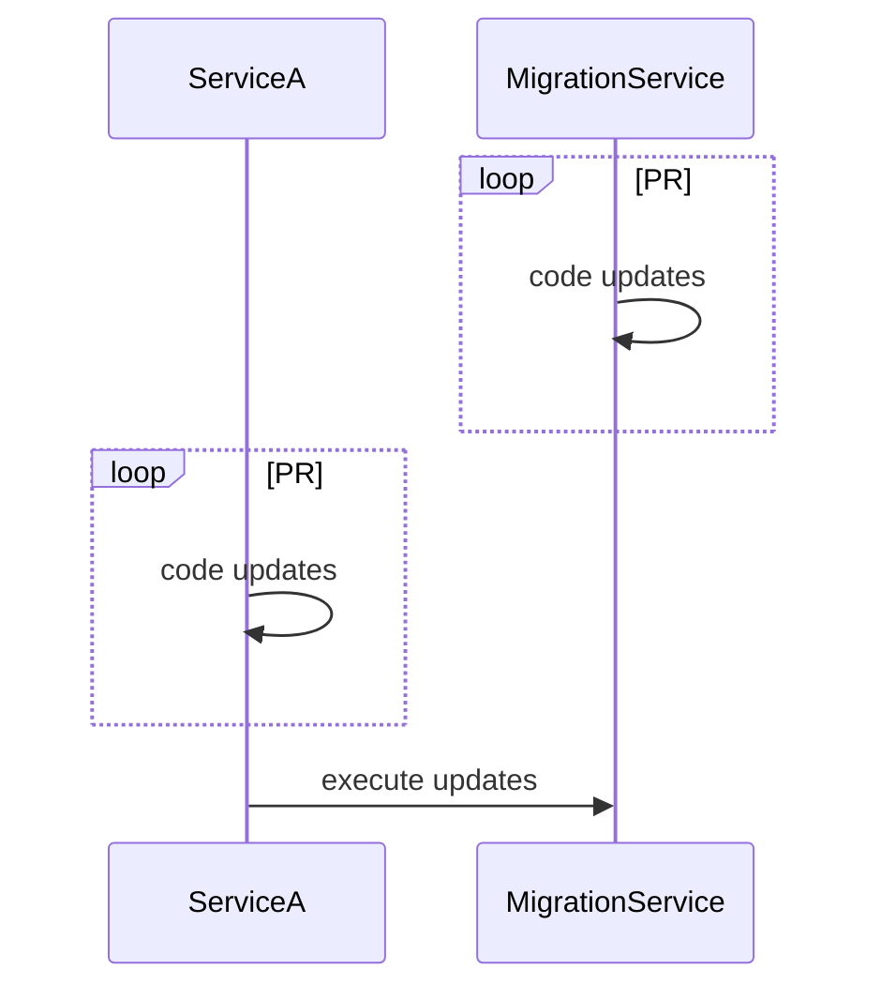

# Database migration service

## Structure
All migrations files located in the `migrations/` folder.
Migration service reads file one by one in alphabetical order and execute it one by one.
In order to work properly migration service require `migration_service` table to be created first


## File structure
Every file represented by `.yaml` standard which that keys:
- `service: <string>` specify service which required this migration
- `migrations: <object>` describe migrations
  - `- version: <int>` set up migration version. Service name + version must be unique
  - `  allowError: boolean`  should migration consider to be successfull even if it failed
  - `  NoAuto: boolean` Do not execute migration in webservice mode
  // - `  noAutoOnly: boolean` Only execute migration in webservice mode
  - `  queries: Array<string>` raw SQL for execution

__Example__:
```yaml
service: migration
migrations:
- version: 1
  allowError: false
  queries:
  - |
    BEGIN;
    CREATE TABLE migration_service (
      id serial NOT NULL PRIMARY KEY,
      name varchar NOT NULL UNIQUE,
      version int NOT NULL DEFAULT 0,
      created_at timestamp with time zone DEFAULT now() NOT NULL
    );
    COMMIT;

- version: 2
  allowError: true
  queries:
  - |
    BEGIN;
    ALTER TABLE migration_service add column with an error syntax
    COMMIT;
```

You can also feel seeds and fixtures if needed
```yaml
service: user-api
migrations:
- version: 1
  allowError: false
  queries:
  - |
    BEGIN;
    insert into user_user (id, email, first_name, date_joined, is_superuser, is_staff)
	   values ('98914f21-a534-403f-8f7e-14792c2d3577', 'example1@gmail.com', 'vlad', now(), true, true),
     values ('98914f21-a534-403f-8f7e-14792c2d3578', 'example2@gmail.com', 'vova', now(), true, true);
    COMMIT;
```

## Usage example
There is two main migration service usage:
#### running migrations locally.
```bash
# set -a && source .dev.env && go run cmd/main/main.go
```

#### automatically applying migrations during merging to dev|stage|master branch
Once github PR reviewed and merged to one of those branches service will execute new migrations automatically

#### running as webservice
If `-http-server` parameter passed service will be available via http requests.
In this mode you can execute migrations when need with an API call:

- Set up FORCE_APPLY=false
- Accept PR with required changed.
- Execute when needed
```bash
# curl -X PUT -s https://migration.{ROOT_DOMAIN}/apply?service=user-api
```

Webservice Workflow diagram:



## Env variables
- FORCE_APPLY=true force apply
- MIGRATION_DIR=./migrations/  yaml file location

